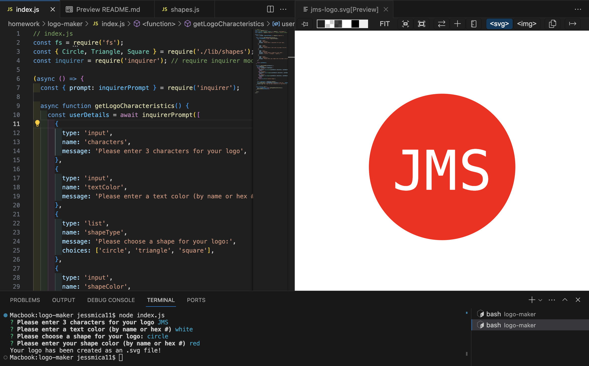

# SVG Logo Maker

## Project Items

View the Walkthrough Video [Here](https://drive.google.com/file/d/1FzBiGqLQ8_VcGnotdPsUQfv6IkfdKP5h/view?usp=sharing)



You can find the sample files in:

```
./examples
```

### Usage Instructions:

1. Open an integrated terminal for the logo-maker
2. Enter "npm i" to install the proper items
3. Run "node index.js"
4. Answer the prompts
5. See the new .svg file created with your logo characters as the naming convention

## Resources/Documentation I Used While Developing this Program

[Inquirer Package](https://www.npmjs.com/package/inquirer)

[ESM Package docs](https://gist.github.com/sindresorhus/a39789f98801d908bbc7ff3ecc99d99c)

[SVG Tutorial - mdn web docs](https://developer.mozilla.org/en-US/docs/Web/SVG)

[SVG Shapes](https://developer.mozilla.org/en-US/docs/Web/SVG/Tutorial/Basic_Shapes)

[extends keyword for classes](https://developer.mozilla.org/en-US/docs/Web/JavaScript/Reference/Classes/extends)

## Complications/Hurdles

I spent a while getting errors and making changes, to then read that newer versions of inquirer.js is an ESM node module, so the code would have to be compiled to work properly (apparently). I went ahead and set inquirer as v 8.0.0 to try to avoid over-complicating my code.

After some time I decided to make files like the provided circle.svg and created the same for the other two shape types. When I was trying to require the svg.js, I was getting too many errors and spending too much time trying to manipulate the dom window and compile. I thought that by having set properties for the shapes and then allowing user input to manipulate that instead, the code would be simpler.

## Your Task

Your task is to build a Node.js command-line application that takes in user input to generate a logo and save it as an [SVG file](https://en.wikipedia.org/wiki/Scalable_Vector_Graphics). The application prompts the user to select a color and shape, provide text for the logo, and save the generated SVG to a `.svg` file.

Because this application won’t be deployed, you’ll need to provide a link to a walkthrough video that demonstrates its functionality and passes all of the tests. You’ll need to submit a link to the video **and** add it to the README of your project.

Refer to the [Video Submission Guide](https://coding-boot-camp.github.io/full-stack/computer-literacy/video-submission-guide) on the Full-Stack Blog for additional guidance on creating a video.

> **Note**: There is no starter code for this assignment.

### User Story

```md
AS a freelance web developer
I WANT to generate a simple logo for my projects
SO THAT I don't have to pay a graphic designer
```

## Acceptance Criteria

```md
GIVEN a command-line application that accepts user input
WHEN I am prompted for text
THEN I can enter up to three characters
WHEN I am prompted for the text color
THEN I can enter a color keyword (OR a hexadecimal number)
WHEN I am prompted for a shape
THEN I am presented with a list of shapes to choose from: circle, triangle, and square
WHEN I am prompted for the shape's color
THEN I can enter a color keyword (OR a hexadecimal number)
WHEN I have entered input for all the prompts
THEN an SVG file is created named `logo.svg`
AND the output text "Generated logo.svg" is printed in the command line
WHEN I open the `logo.svg` file in a browser
THEN I am shown a 300x200 pixel image that matches the criteria I entered
```

---

© 2023 edX Boot Camps LLC. Confidential and Proprietary. All Rights Reserved.
